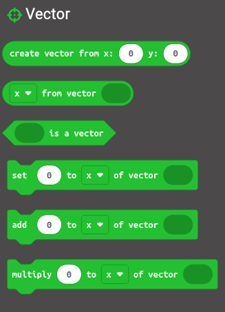

> Open this page at [https://matiasvlevi.github.io/vector_microbit/](https://matiasvlevi.github.io/vector_microbit/)

# Makecode Vector Data Type

Adds the Vector Data type

 

# Problem this extention solves

I wanted to send vectors (or tuples) over radio or serial in makecode.
The radio and serial only allows for `number`, `key value` and `string` to be sent.

I couldn't get 1 radio recieve event to handle a 2 value pair.

The vector data type handles the conversions from vector to string automatically, so you can send values over radio.

It also includes utilities for vector math.

 

# Simple Read Example

Here we're reading a vector from the radio. The vector was automatically converted to a string since it was used as one.

the `recievedString` can now be used as a read-only vector.

 

# Mutable Vector Example

Since `recievedString` is not a vector instance, we need to convert it back to a vector and store it to be able to modify/mutate it.

In this example, a `recievedPosition` variable is set to the converted `recievedString`

we then add `1` to both `x` and `y` components

 

## More blocks

Here are some included utilities

 

## Use Extension

This repository can be added as an **extension** in MakeCode.

- open [https://makecode.microbit.org/](https://makecode.microbit.org/)
- click on **New Project**
- click on **Extensions** under the gearwheel menu
- search for **https://github.com/matiasvlevi/vector_microbit** and import
