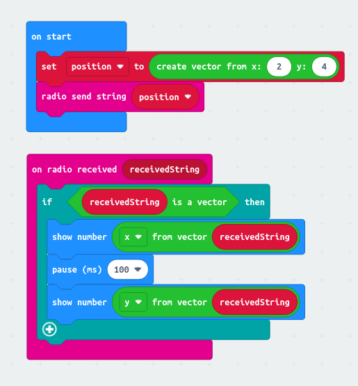

# Microbit Vector Extention

> Open this page at [https://matiasvlevi.github.io/vector_microbit/](https://matiasvlevi.github.io/vector_microbit/)

Adds the Vector Data type

# Example

The vector datatype is converted to a string when sent over radio.
This allow you to send 2 number values over radio (or serial) without using string manipulation blocks.

### More blocks

Here are some included utilities

## Use Extension

This repository can be added as an **extension** in MakeCode.

- open [https://makecode.microbit.org/](https://makecode.microbit.org/)
- click on **New Project**
- click on **Extensions** under the gearwheel menu
- search for **https://github.com/matiasvlevi/vector_microbit** and import
